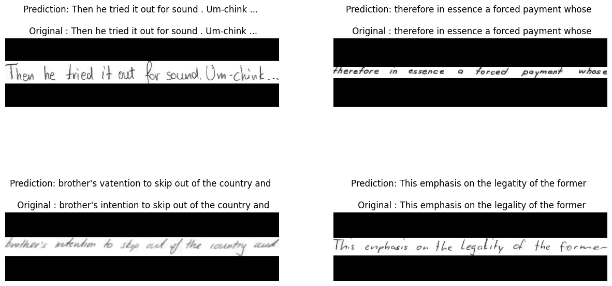
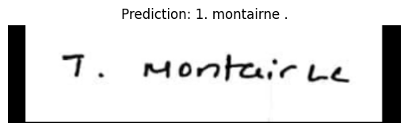
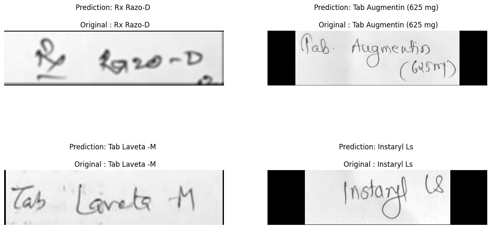
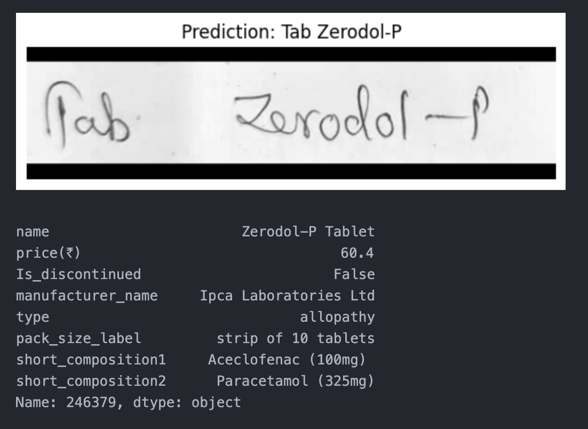
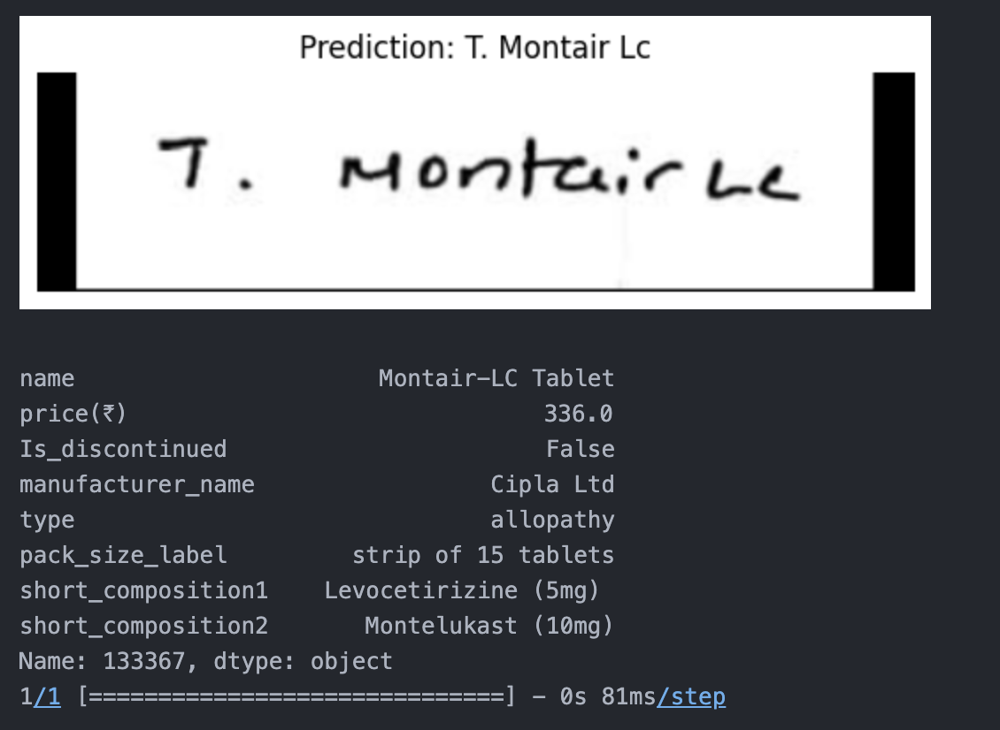
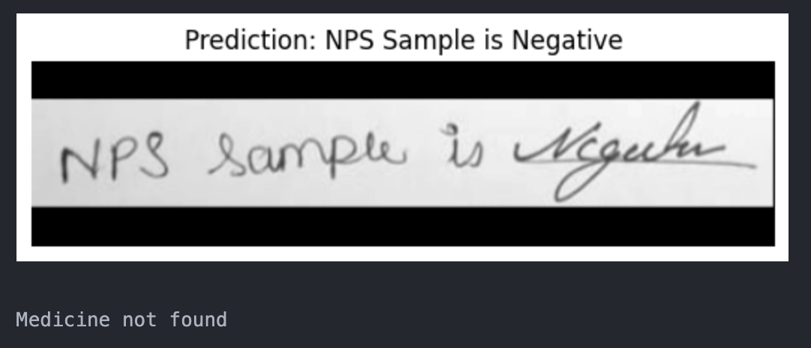

# text-extraction-from-doctor-prescriptions
The model developed in this project can extract medicines from pictures of handwritten doctor's prescriptions and output information about that medicine.

I trained the model using IAM (lines) dataset to recognise handwritten texts. The model was successfully reconising images from test set from IAM dataset.

  

Then, I tried the model to recognise a medicine name from a doctor's handwritten prescription, the result was not accurate.

To improve the performance of the model for doctors' handwritten prescriptions, I fine-tuned to the model using a custom datset built and annotated by me which can be found in custom_data folder. The fine-tuned model was able to reconise doctors' handwriting and gave accurate predictions.

The final task for the project is to recognise and show information about a medicine. I used Fuzzy String Matching Algorithm to search the dataset for the medicine name extracted from handwritten prescrition. I was able to successfully search the medicines.csv file for a particular medicine and print its details.

Here, the text is not a medicine.

